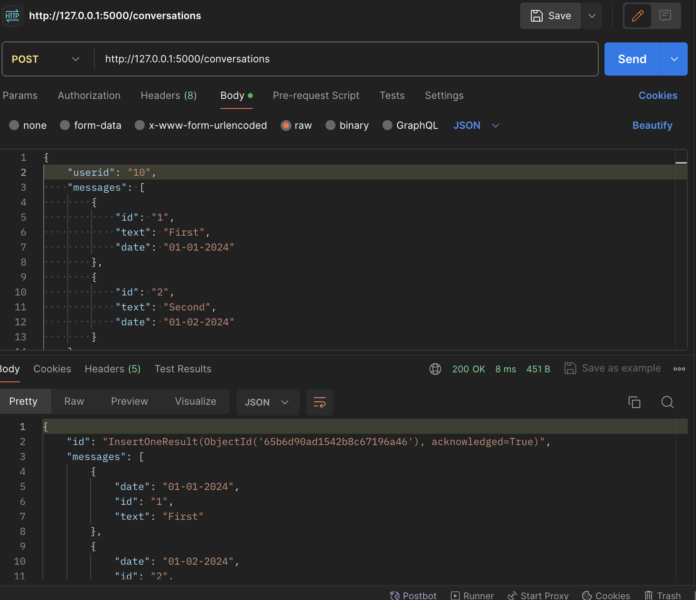
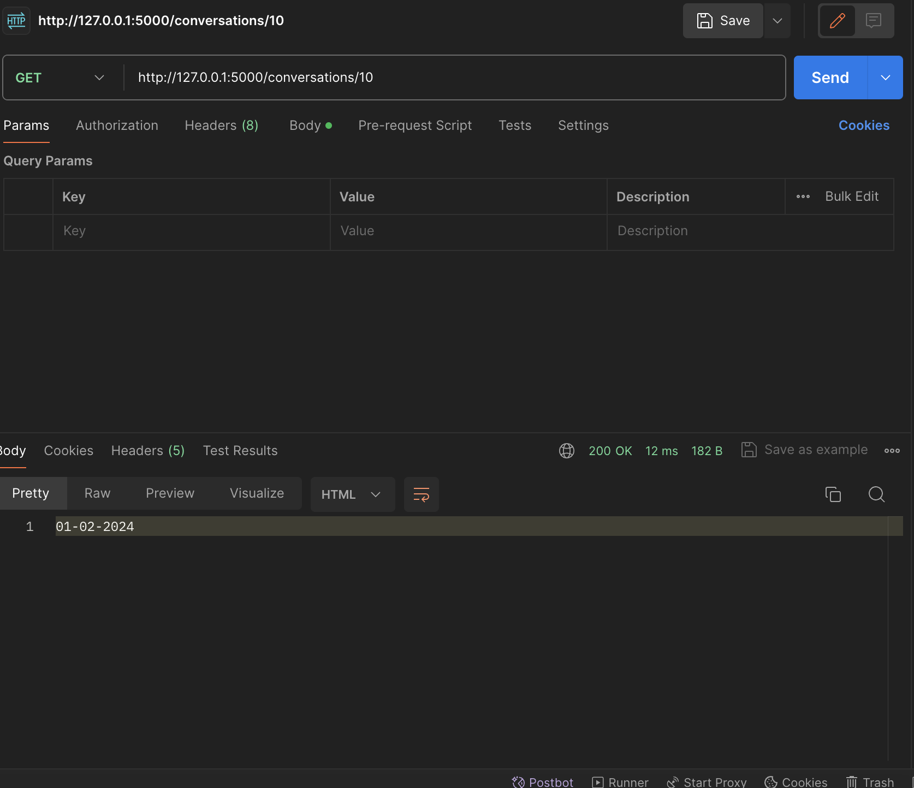

# meli-backend-py
Meli backend test using python

### Instalacion de MongoDB con docker

``` sh
docker run --name some-mongo -p 27017:27017 -d mongo
```
### Instalacion de dependencias
``` sh
$ sudo pip install -r requirements.txt
```
### Ejecutar la app
``` sh
python3 ./src/app.py
```

## Create conversation


## Get last conversation date by userid
